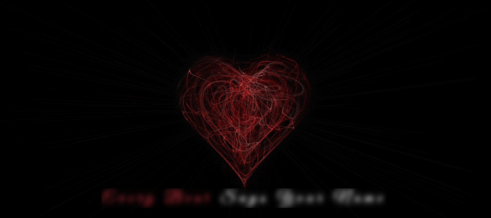

# Smoky Heart 🌫️💕 

A stunning animated web experience that delivers a heartfelt message — *"Every Beat Says Your Name"* — using glowing, smoky text and a subtle animated heart in the background. Built with love using HTML, CSS, and JavaScript.

## Preview

 
***See how it looks like***

## Features

- Elegant typography with a romantic flair  
- Smoky animated text with glowing effects  
- Heartbeat-style background animation using `canvas`  
- Smooth, infinite animation loops  
- Fully responsive layout

## How It Works

The animation uses a combination of CSS for text blur and glowing effects, and JavaScript to animate a pulsing heart on the canvas. Each letter of the message animates with a delay to give a smoky, wave-like motion.

## How to Use

1. Clone or download the repository.  
2. Open the `index.html` file in your browser.  
3. Customize the message in the `.smoke` div.  
4. Modify colors, fonts, or animation speeds in `style.css` if needed.

## Technologies Used

- HTML5  
- CSS3  
- JavaScript (Canvas API)  
- Google Fonts

## Customization
You can easily change:
- The message text inside `index.html`
- The font style by switching the Google Font
- The color palette and animation blur levels in `style.css`
- The canvas animation logic in `script.js`

## Contributing
We welcome contributions! You can:
- Fork the repository  
- Create a new feature branch  
- Make your changes  
- Submit a pull request  

Please keep your code clean and well-documented.

## Perfect For

- Valentine's Day  
- Digital love letters  
- Romantic web pages  
- Creative front-end demos

---
**Each glow, each blur, each beat is a silent poem only hearts can read.🎀🧿**
